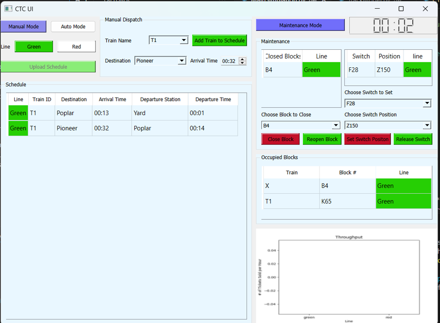
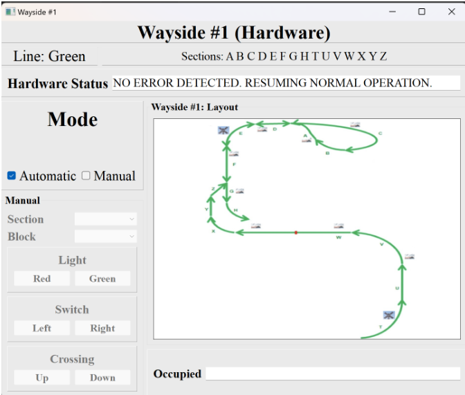

# OJ AND THE COWBOY HATS: Autonmous Train System
A detailed guide on how to install and run our autonomous train system.

# MEMBERS:
| Name | Module |
| ----------- | ----------- | 
| Abby Magistro | CTC |
| Alexander Smith | SW Track Controller |
| Lillian Jones | HW Track Controller |
| Anh Nguyen |  Track Model |
| Tanvi Verma |  Train Model |
| Lauren Gilfillan | SW Train Controller |
| Chad Collina | HW Train Controller |


## Usage
The following sections discuss the correct usage of our autonomous train system.
Prerequisites: [Python 3.9 or greater](https://www.python.org/downloads/) 


## Installation and Setup

1. Use the package manager [pip](https://pip.pypa.io/en/stable/) to install the required packages listed in requirements.txt.

```bash
pip install -r requirements.txt
```

or

```bash
pip install matplotlib pandas PyQt5 PyQt5_sip pyserial PySide6
```

2. Retrieve system code from our [ECE 1140](https://github.com/asmithie13/ECE-1140/releases) git repository.
3. Unzip the files in a convenient location

### Raspberry Pi Setup
**Enable Serial Communication**
1. Configure the USB-to-Serial adapter on the Raspberry Pi 4 pins as follows:
    - White = GPIO 14 (TXD)
    - Green = GPIO 15 (RXD)
    - Black = Ground


2. Plug the other end of the adapter into the USB port on the computer.
3. Follow instructions to install appropriate drivers for the hardware: (https://learn.adafruit.com/adafruits-raspberry-pi-lesson-5-using-a-console-cable/software-installation-windows)
4. Check “Device Manager” on the machine to determine which COM port corresponds to hardware. Change this accordingly within the code.

**Connect Remotely to Raspberry Pi 4**
1. Install VNC Viewer to view PLC File Upload UI: (https://www.realvnc.com/en/connect/download/viewer/)
2. Run UI with Visual Studio Code and upload appropriate PLC file

## Use Instructions

### Starting the simulation

1. Find the file named Start Simulation.bat and run it. 
2. Start Simulation.bat ensures that the user has all python packages installed. The user should ensure that they have the correct version of Python installed as mentioned in 

### Opening and Running a Train

**NOTE*: By convention, the order of initial dispatching of trains from the yard must correspond to the Train ID number, i.e. T1 must be dispatched first, followed by T2, etc. There are sample schedules available in the CTC/Schedules folder that follow this convention, but it is the responsibility of the scheduler to ensure this convention is followed.

**In Manual Mode:** 
1. Open the CTC UI
2. Select Manual Mode
3. By default, a new train will be dispatched, indicated by the * in front of the Train ID. If you are adding a stop to a train that’s already dispatched, select the intended Train ID from the drop down.
4. Select the destination and the arrival time. Destinations should be added to the schedule in the order they are in on the route.
5. Click the “Add Train to Schedule” button. This will calculate the dispatch time and departure station, and add the information to the schedule.


**In Automatic Mode:**
1. Open the CTC UI
2. Select Automatic Mode
3. Click the “Upload Schedule” button  and select the .csv file containing the schedule. (Sample Schedules under CTC/Schedules, see Schedule Formatting below for more details)
4. Click Open. The schedule will automatically populate with all the dispatch information on the schedule


**Schedule Formatting:**

- Schedules must be .csv files
- A schedule file’s header row should be “Line,TrainID,Destination,ArrivalTime”
- Each line after the header will represent one entry on the schedule
    - Line should be either Green or Red
    - TrainID must be in the format “T1”, and follow the convention on order of initial dispatch mentioned above
    - Destination should be a station from the correct line and capitalized
    - ArrivalTime should be in the hh:mm format, on a 24 hour clock


### CTC UI



For information on dispatching a train, refrence the **Opening and Running a Train** Section

**Maintenance Mode:**

Click the Maintenance Mode button to enter Maintenance Mode

- To see block and switch options, make sure a line color is selected
- To close a block, select the block ID and click the "Close Block" button,
- To set a switch position, select the block ID of the switch, then select the block ID indicating the switch positon. Click the "Set Switch Position" button. 
- To reopen a block or release a switch under maintenance, reselect the correct ID of a block or switch that is closed and select the "Reopen Block" button or the "Release Switch" button.

### Wayside Software UI

### Wayside Hardware UI



1. The wayside module begins in automatic operation. This means that a valid PLC file must be uploaded to the Raspberry Pi 4 prior to train dispatch. Do this by completing the following steps:
    1. Follow all previous instructions to establish serial communication and connect remotely to RPi.
    2. Run “piUI.py” file on the Raspberry Pi 4. After doing this, a dialogue box will open, prompting the user to upload a PLC file. Find the desired file within the machine’s directory, select the file, and click “Open”. **Do not close out of the dialogue box after this step.** No more work is required on the Raspberry Pi.


    
2. After the PLC file is uploaded, the module will respond to block occupancies automatically as the main simulation is run. No input is required from the PLC programmer.
3. If the user wishes to put the train into manual operation, select the corresponding checkbox. This will allow block attributes to be changed by simply selecting the block.

**Wayside Hardware FAQ:**
- Why are errors being detected in automatic mode?
    - The PLC file was not valid, or it was never uploaded. Please try uploading an accurate, properly-formatted PLC file.
    - Another possible problem is that serial communication was not established correctly. Re-trace the steps in Part II to ensure accuracy.
- How can I ensure that switch, light, and crossing states are being calculated correctly in automatic mode?
    - Switch, light, and crossing states are reflected in the Track Model UI. Please refer to this UI for confirmation.
- Is there protocol in-place for preventing collisions between trains? Does this protocol apply to block closures?
    - Yes. Per-block authority is calculated every time a new block occupancy is detected. Two trains will never collide, as per this calculation. Closed blocks are interpreted as occupancies by this module, so the same protocol applies.


### Track Model 


1. Selecting a line in the top middle, Green or Red. A map should appear in the UI.
2. Select a block via drop down or by clicking on the block directly. Information about the track should show up on the right, including Block Occupancy.

- If the user wants to upload a different track layout, they can do so by clicking the green upload track layout button and selecting an XML or CSV file.
- Murphy can select a failure by selecting a block and click the button to trigger that failure. 
- The Track Model can toggle the track heaters by changing the environmental temperature.


### Train Model UI


- The left side indicates all the numbers calculated by using Newton's Laws.
- The right side displays live train statistics.
- Murphy’s failures can be sent using the Enable/Disable buttons by simply clicking on them.
- The emergency brake can be toggled on the bottom. 
- As a user, you can view the status of the interior lights, exterior lights, doors and cabin temperature.


### Train Controller Software/Hardware  UI 


#### Moving the Train
    Once the departure time set by the CTC is hit by the global clock, the Train Controller UI will automatically open. 
    
##### Increasing the Speed 

The train will be **stopped** upon deployment. In order to get the train moving you have two options...

**If Authority or Commanded Speed is zero the Train will not move no matter what inputs you provide**

1. Increase the Accelerartion Slider
Click on the Slider and drag upwards. Once desired speed is reached, drag the accerlation slider all the way down to zero. This will allow the Train to coast 

2. Change into Automatic Mode
In the upper right hand corner, click the 'automatic' button, the accerlation slider should automatically toggle and increase the speed of the Train

#### Decreasing the Speed 
1. Increase the brake slider to 1. The slider only has 2 states, 1 or 0.
2. In case of emergency, the EBrake Button will stop the train at a faster rate then the brake slider

#### Entering KI and KP
Type or use the arrows on the text boxes. The default values are optimal for operation but can be changed if so desired. The changes should only be made by the Train Engineer

#### Changing into Automatic/Manual Mode
Use the toggle buttons in the top left, the depressed button is the current mode.

#### Station Announcements 
Type the desired message in the box next to annoucement and press enter. The output should appear next to Current Output. 

#### Temperature

#### Door Control
Press open or close on the desired door. Doors cannot be opened while moving

#### Lighting Control

#### Interior 
In the upper right hand corner, next to Int, use the slider to either select 0 , 1 , 2. Where zero is off, one is dim, and two is full brightness


##### Exterior 
In the upper right hand corner, next to the text Headlights, select either on or off. The depressed button in the current satat


#### Automatic Functionality

#### Why isn't my Train Running?
1. Does the Train Have Authority?
If the train recieves an authority of zero, it will not move. Authority can be viewed on the right hand side labeled "Distance to Stop" 
2. Are either of the brakes enabled?

On the center of the screen there is brake slider, if the value is displaying '1', this means the service break is on.
Simply slide the slider down to turn it off

If either the
    3. Is the Train at a red light?
    4. Your Train is imputed?
        This is usually caused by the weight of your mama on the train

#### 

## License

[MIT](https://choosealicense.com/licenses/mit/)
